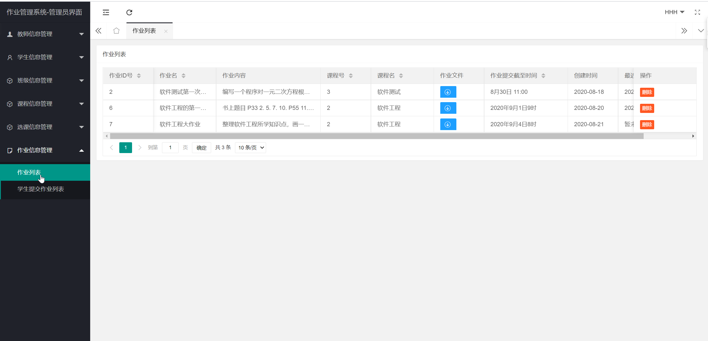
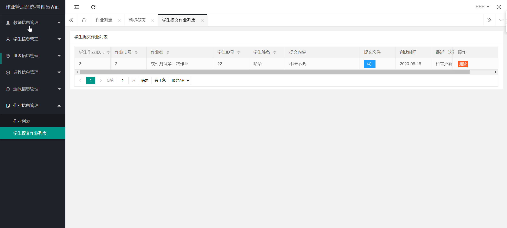
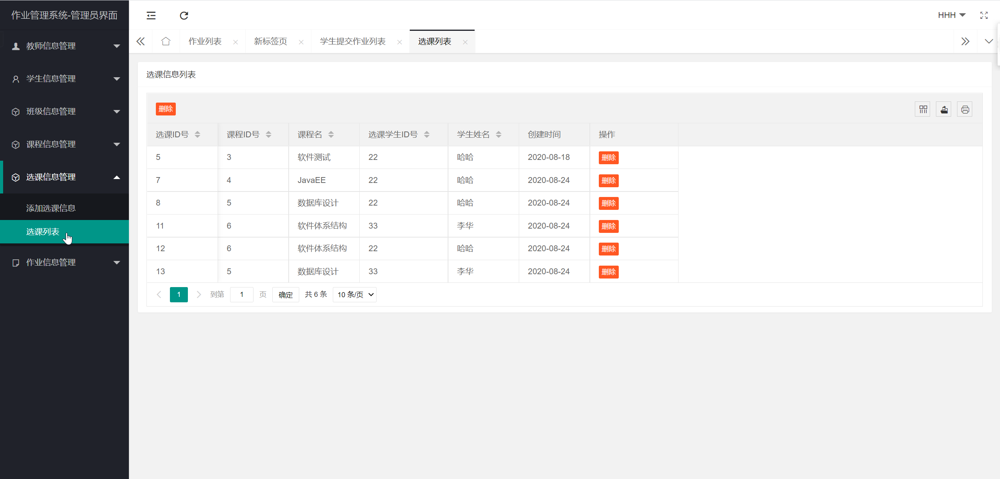
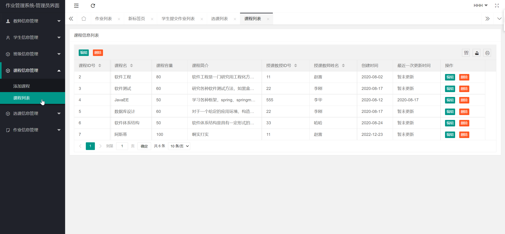
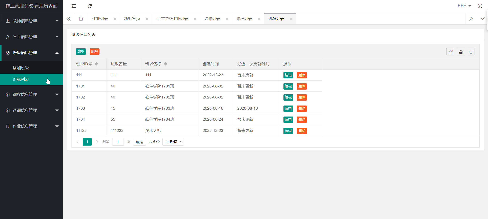
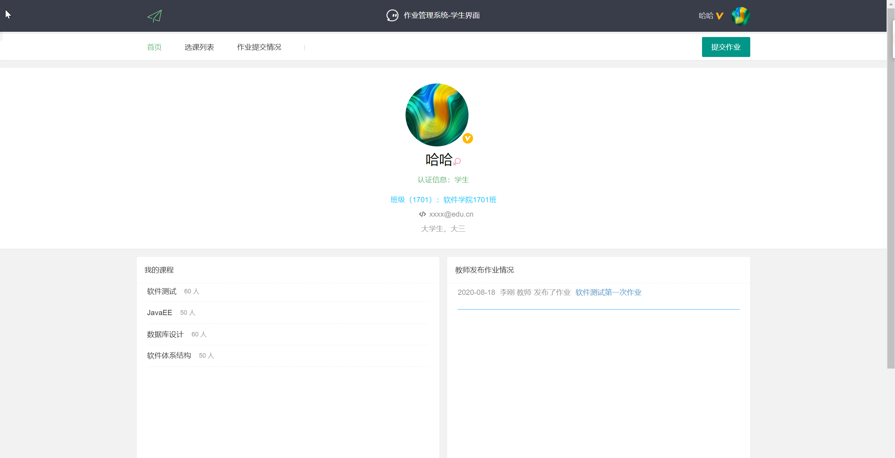
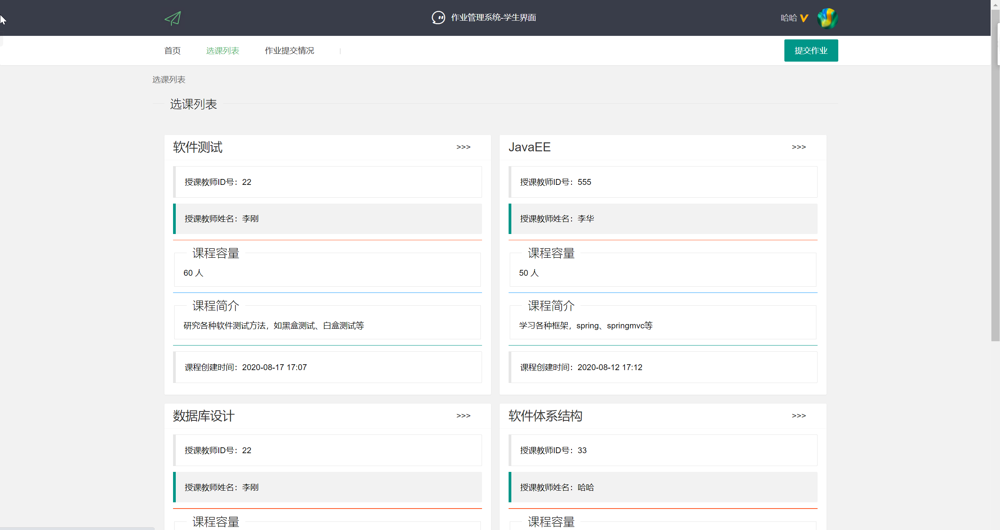
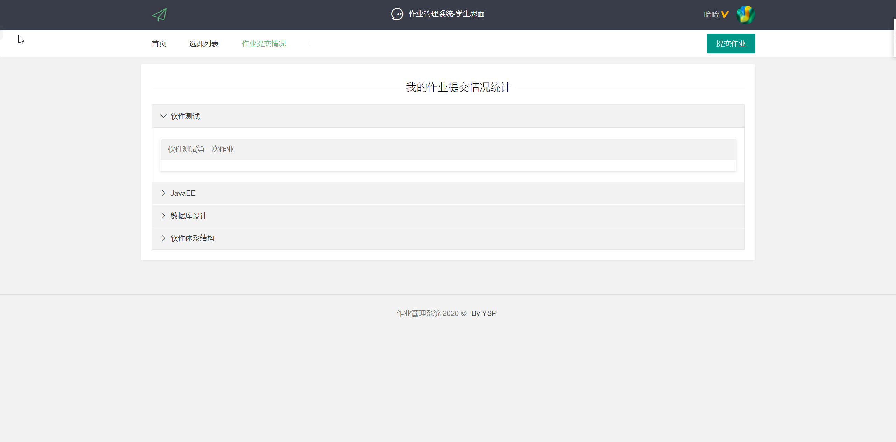
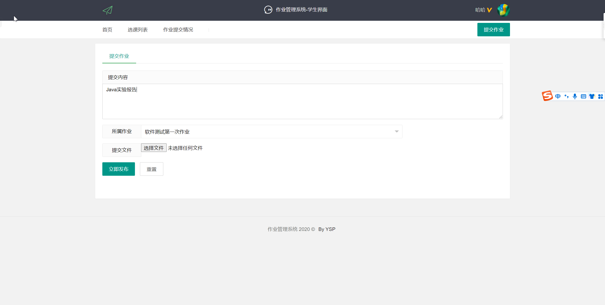

## 基于SSM框架的作业管理系统

- <b>完整代码获取地址：从戎源码网 ([https://armycodes.com/](https://armycodes.com/))</b>
- <b>技术探讨、资料分享，请加QQ群：692619798</b> 
- <b>作者微信：19941326836  QQ：952045282</b> 
- <b>承接计算机毕业设计、Java毕业设计、Python毕业设计、深度学习、机器学习</b>
- <b>选题+开题报告+任务书+程序定制+安装调试+论文+答辩ppt 一条龙服务</b>
- <b>所有选题地址 ([https://github.com/YuLin-Coder/AllProjectCatalog](https://github.com/YuLin-Coder/AllProjectCatalog)) </b>

## 项目介绍
基于SSM框架的作业管理系统，有学生、老师、管理员三个角色，主要功能如下
学生：
- 修改个人信息（包括密码）
- 查看自己所属的班级信息
- 查看自己所选的课程信息
- 查看教师所布置的作业信息
- 提交作业、修改已提交的作业

老师：
- 修改个人信息（包括密码）
- 查看自己所教授的课程信息
- 查看选课学生信息
- 发布作业
- 修改已布置的作业
- 删除已布置的作业

管理员：
- 修改个人信息（包括密码）
- 添加教师信息、修改教师信息、删除教师信息、查看教师信息
- 添加学生信息、修改学生信息、删除学生信息、查看学生信息
- 添加班级信息、修改班级信息、删除班级信息、查看班级信息
- 添加课程信息、修改课程信息、删除课程信息、查看课程信息
- 添加选课信息、修改选课信息、删除选课信息、查看选课信息
- 删除作业信息、查看作业信息
- 删除学生提交作业信息、查看学生提交作业信息

## 项目技术
- 编程语言：Java
- 数据库：MySQL
- 前端技术：HTML、CSS、Layui
- 后端技术：Spring、SpringMVC、MyBatis

## 运行环境
- JDK版本：JDK1.8及以上
- 开发工具：IDEA、Ecplise、Myecplise都可以
- 数据库: MySQL5.7及以上

## 运行截图

